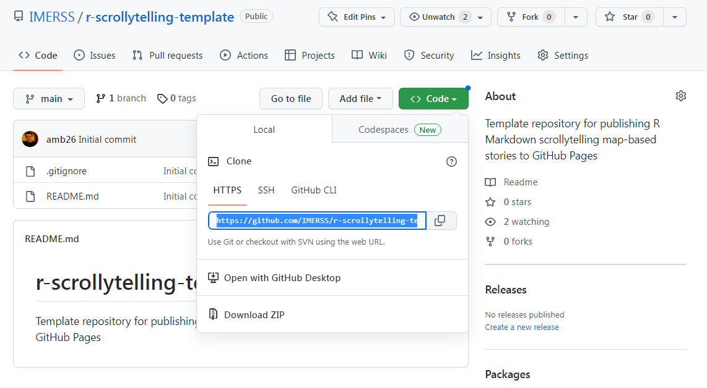
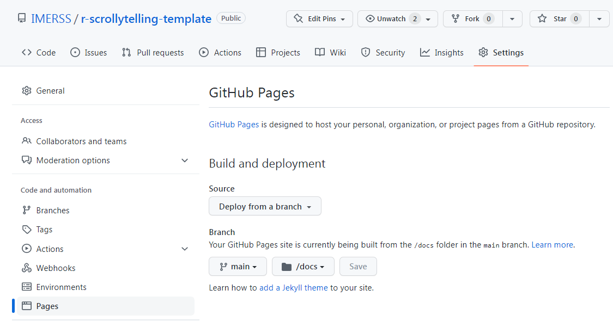

# R Markdown Scrollytelling Template Repository

This project hosts a skeleton structure suitable for building out and publishing a map-based scrollytelling
interface based on [R Markdown](https://rmarkdown.rstudio.com/). You can build your own scrollytelling interface
using R and R Markdown, using free tools such as git, R and R studio, and publish and host it for free using
[GitHub Pages](https://pages.github.com/).

These files were distilled from work done for the
[Maxwell Creek Watershed Project](https://transitionsaltspring.com/maxwell-creek-watershed-project/) which is being
undertaken by [Transition Salt Spring](https://transitionsaltspring.com/).

You can browse the kind of scrollytelling interface which can be produced in the
[Maxwell Project's GitHub pages](https://imerss.github.io/maxwell/). You can browse this own template
repository's output at [R-Markdown-Background-Reknitted.html](https://imerss.github.io/r-scrollytelling-template/R-Markdown-Background-Reknitted.html).

As a general guide to the potential of storymapping frameworks to use data to tell stories, you can visit two
thoroughly elaborated [data explorations](https://www.data-arc.org/my-front-page/example-data-explorations/) from
the dataARC project which present two stories, "Quantifying an ever-changing landscape" and "Data mining the past"
using two mature storymapping frameworks, [ESRI/ArcGIS Storymaps](https://storymaps.arcgis.com/) and [HTML + Binder/Jupyter](https://mybinder.org/).

Here we operate a homegrown approach showing how readily available and widely understood open source tools can be
orchestrated to produce a basic end-to-end authoring and hosting environment.
Consult [Knitting Data Communities](https://lichen-community-systems.github.io/knitting-data-communities/) for some values
underlying this work.

## Installation instructions

If you haven't worked with this kind of project before, you will need the following tools:

* git for your platform, installed according to instructions like [these ones from GitHub](https://github.com/git-guides/install-git).

* R and R studio, installed from [posit's website](https://posit.co/download/rstudio-desktop/)

In order to reknit the markup rendered by R and R markdown, you will also need the following optional tools:

* node and npm for your platform, installed according to [node's instructions](https://nodejs.org/en/download/).

Rather than doing this yourself, you could enlist a friendly developer to do these actions for you and commit to
your repository. Before long, this repository will contain automatic actions to do this using
[GitHub Actions](https://github.com/features/actions).

## Starting your own work based on this repository

To make your own fork of this repository to start filling it with your own content, follow GitHub's instructions on
[forking a repository](https://docs.github.com/en/get-started/quickstart/fork-a-repo#forking-a-repository) - you will want
to choose a new name for the repository as shown in step 4 of these instructions.

For a more simple-minded approach, you can simply copy all the files resulting from cloning this repository into a new
folder on your system (missing out the `.git` directory).

After this, you can switch to Posit's instructions on
[using git with R Studio](https://support.posit.co/hc/en-us/articles/200532077-Version-Control-with-Git-and-SVN) - go to
the section named "Creating a new project based on a remote Git or Subversion repository" and supply the repository URL
for your forked repository at step 4. If you haven't worked with these tools before, you will want to choose the HTTPS
version of the repository URL available from the "Code" dropdown as shown in the following picture:

Another useful guide is at [Connect RStudio to Git and GitHub](https://happygitwithr.com/rstudio-git-github.html).

If you are going to do your own reknitting, you will now need to download node dependencies for this project by opening
a terminal in its root folder and typing

    npm install

## Knitting and reknitting markup from your markdown

The first part of the publishing chain is to use the builtin "knitting" functionality in R studio described in the
[authoring guide](https://rmarkdown.rstudio.com/authoring_quick_tour.html) - open up the .Rmd file at the roof of the project
and click on the small "Knit" button above it. This will produce markup in the "docs" directory. You can commit this
to GitHub pages and hence publish it by following the steps in
[section 12.4](https://happygitwithr.com/rstudio-git-github.html#make-local-changes-save-commit) of the guide to using
GitHub in R studio.

If this all works fine, you can proceed with editing the document in [R-Markdown-Background.Rmd](R-Markdown-Background.Rmd),
and building out scripts for further maps in [scripts](scripts), vector data as SHP flies in
[spatial_data/vectors](spatial_data/vectors) and raster data in [spatial_data/rasters](spatial_data/rasters).
Please consult the [using Leaflet with R](https://rstudio.github.io/leaflet/) guide for how to add your own map data
to your maps.

The sample map contains one simple vector and one simple raster dataset. Each second-level heading in the document -
rendered using ## in markdown, and an `<h2>` tag in the output markup, will correspond to a separate section in the
scrollytelling interface. Each leaflet map that you render in such a section will be compiled by the reknitting process
into a separate map layer on the shared map. Note that not many R leaflet constructs are currently supported by the
reknitting process - [contact us](https://github.com/IMERSS/r-scrollytelling-template/issues) with details of what you
would like to see.

Once your customised map knits properly using the R Studio "Knit" process, you can reknit it by running

    npm run build

from the terminal in the project folder. Commit and push the output from this stage using R Studio or git as you prefer.

If you want to reknit to different input or output filenames, edit the reknitJobs block in the configuration file
at [config.json5](config.json5). To customise the markup which frames the reknitted output, you can edit the HTML
template at [src/html/template.html](src/html/template.html).

## Setting up GitHub Pages to publish your markup

To publish the markup resulting from both the knitting and the reknitting process, set up the configuration on your
repository to publish GitHub Pages from the `docs` folder of the `main` branch. This is available from the `Pages`
tab on your repository's settings, as shown in the image below:

You can find our what URL your markup will be published at by looking in the [docs](docs) directory of your own
repository. For example, the [docs/R-Markdown-Background-Reknitted.html](docs/R-Markdown-Background-Reknitted.html)
file is published at [https://imerss.github.io/r-scrollytelling-template/R-Markdown-Background-Reknitted.html](https://imerss.github.io/r-scrollytelling-template/R-Markdown-Background-Reknitted.html).

The overall URL of your documents published in GitHub pages will start with `https://<your-account>.github.io/<your-repository>`.

## Get involved

To suggest improvements to these instructions and publishing system, please
[raise an issue](https://github.com/IMERSS/r-scrollytelling-template/issues). For a wider background
surrounding this project and its philosophy, please go to
[Knitting Data Communities](https://lichen-community-systems.github.io/knitting-data-communities/).
